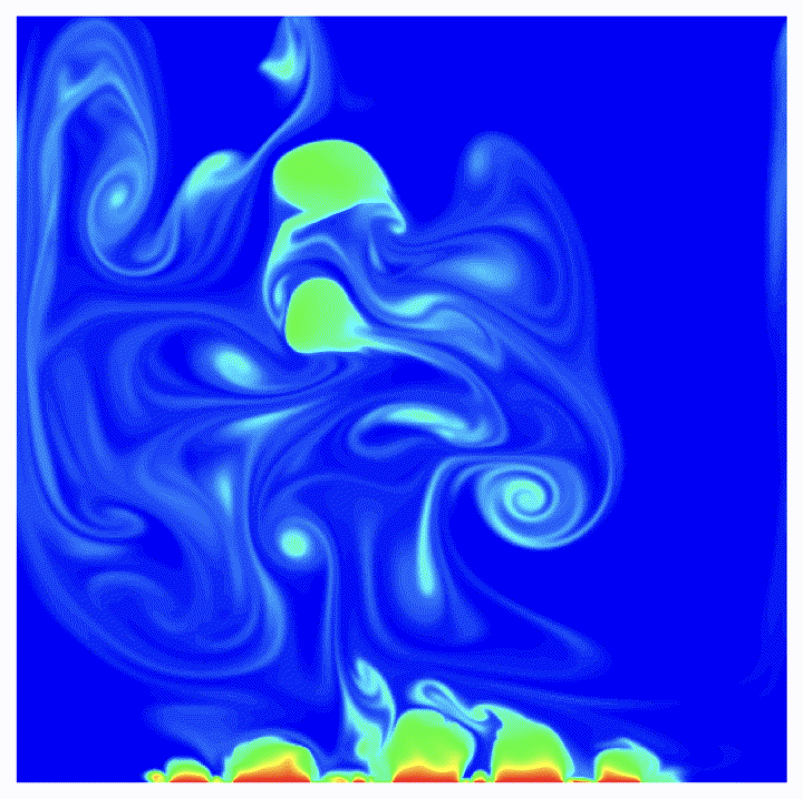

##### Project Links

+ [Openreview](https://openreview.net/forum?id=0Wmglu8zak)
+ [Github](https://github.com/HPCForge/BubbleML)

---

##### Sample frame of subcooled boiling simulation



---

##### Citation

```BibTeX
@inproceedings{
    hassan2023bubbleml,
    title={Bubble{ML}: A Multi-Physics Dataset and Benchmarks for Machine Learning},
    author={Sheikh Md Shakeel Hassan and Arthur Feeney and Akash Dhruv and Jihoon Kim and 
            Youngjoon Suh and Jaiyoung Ryu and Yoonjin Won and Aparna Chandramowlishwaran},
    booktitle={Advances in Neural Information Processing Systems},
    year={2023},
    url={https://openreview.net/forum?id=0Wmglu8zak}
}
```

---